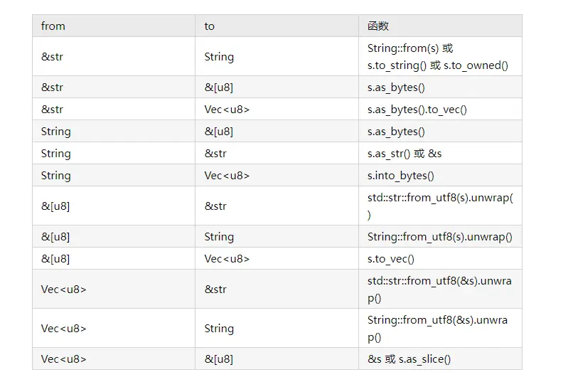

# Rust 中常见类型的转换

## 1. `String`，`＆str`，`Vec<u8>` 和 `＆[u8]` 的惯用转换

### 1. 总览
1. 基本的转换方式如下图所示：



### 2. String

1. `&str`

```rs
1. s.as_str()

2. &s
```

2. `&[u8]`
```rs
s.as_bytes()
```

3. `Vec<u8>`
```rs
s.into_bytes()
```

### 3. &str

1. `String`
```rs
1. String::from(s)

2. s.into_string()

3. s.to_owned()
```

2. `&[u8]`
```rs
s.as_bytes()
```

3. `Vec<u8>`
```rs
s.as_bytes().to_vec()
```

### 4. &[u8]


1. `&str`
```rs
std::str::from_utf8(s).unwrap()
```

2. `String`
```rs
String::from_utf8(s).unwrap()
```

3. `Vec<u8>`
```rs
s.to_vec()
```

### 5. Vec<u8>

1. `&str`
```rs
std::str::from_utf8(&s).unwrap()
```

2. `String`
```rs
String::from_utf8(&s).unwrap()
```

3. `&[u8]`
```rs
1. &s

2. s.as_slice()
```